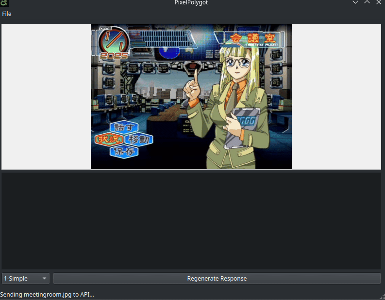

# Pixel-Polygot

[](https://www.gnu.org/licenses/gpl-3.0)
[](https://python.org)
[](https://briefcase.readthedocs.io)


Pixel-Polygot is a desktop application designed to read text from game screenshots and translate it into English using AI vision models.




## Features

*   **Image Loading:** Open image files directly (`.png`, `.jpg`, `.webp`, etc.).
*   **Automatic Monitoring:** Watch a specified directory for new screenshots and process them automatically.
*   **AI-Powered OCR & Translation:** Sends images to a configured AI API (supports Ollama and OpenAI-compatible endpoints) to extract and translate text.
*   **Customizable Prompts:** Select different system prompts to guide the AI's response.
*   **Configurable API:** Easily configure the API endpoint, model, and API key via the settings menu.
*   **Response Regeneration:** Resend the current image to the API if the initial response was unsatisfactory.
*   **Cross-Platform:** Built with Beeware, aiming for compatibility with Linux, macOS, and Windows.

## Important Notes & Caveats

Please keep the following points in mind when using Pixel-Polygot:

*   **Translation Speed:** The time it takes to get a translation depends heavily on the speed of the connected AI API endpoint or your local hardware if running a model yourself (e.g., via Ollama or Koboldcpp). Performance variations can be observed in the demo video.
*   **Model Choice (Qwen2.5-VL):** Most development testing was performed using `Qwen2.5-VL-7B`. While other vision models can be used, many current alternatives struggle with accurately recognizing and translating Japanese text from images compared to Qwen.
*   **AI Variability:** Translations are generated by Large Language Models (LLMs). Results can vary depending on the model used, the prompt selected, and the complexity of the image content. Expect occasional inaccuracies or inconsistencies.
*   **Early Development:** This project is currently in its early stages. Both the application itself and the included prompts are under active development and subject to improvement. Functionality may change, and translations might not always be perfect.
*   **Local Qwen Execution (Koboldcpp):** As of the current release, using [Koboldcpp](https://github.com/LostRuins/koboldcpp) is the primary recommended method for running the `Qwen2.5-VL` model locally for use with Pixel-Polygot.

## Included Prompts

The application allows you to select different "prompts" from a dropdown menu. These prompts instruct the AI on how to format its response and what kind of translation to provide. The following prompts are included by default:

*   **1-Simple:** Provides a direct, natural English translation for each detected block of Japanese text, followed by optional translation notes. Good for quick understanding.
    ```
    [Japanese Text]
    [English Translation]
    [Translation Notes (if needed)]
    ```
*   **Full-Table:** Attempts to categorize detected text (Dialogue, UI, Items, etc.) and presents the Japanese text, English translation, and notes within structured Markdown tables. Useful for detailed analysis or localization work.
*   **Visual-Novel:** Designed specifically for visual novel screenshots. It aims for high fidelity, mirroring VN dialogue boxes with strict formatting, including character names (if detected) and explicit error handling for untranslated text.
    ```
    **[Character]** (if present)
    「Japanese Text」
    → *"English Translation"*
    *(Note: [Only if needed])*
    ```
*   **Fallback:** If selected, this uses the default prompt defined in your `config.json` file (see Configuration section below). Normally used for quick prompt testing.

You can add your own custom prompts by creating `.md` files in the `src/pixelpolygot/prompts/` directory. They will automatically appear in the dropdown menu.

## Configuration

Pixel-Polygot requires configuration to connect to an AI API. Settings are stored in `src/pixelpolygot/config.json` and can be managed via the "File" -> "Settings" menu in the application. If the file does not exist on first run a generic one will be created on first run.

**Key Settings:**

*   `api_type`: The type of API to use (`openai` or `ollama`).
*   `api_url`: The base URL of the API endpoint.
*   `api_key`: Your API key (required for most OpenAI-compatible APIs, may not be needed for local Ollama).
*   `model`: The specific AI model name to use (e.g., `gpt-4-vision-preview`, `llava`, `qwen2.5-vl-7b-instruct`).
*   `prompt`: The default text prompt sent along with the image. **This prompt is used when "Fallback" is selected in the prompt dropdown menu.**
*   `watch_directory`: The directory to monitor for new images (leave blank to disable).

**Example Configurations:**

*   **Local Ollama (using LLaVA):**
    *   `api_type`: `ollama`
    *   `api_url`: `http://localhost:11434` (Default Ollama address)
    *   `api_key`: (Leave blank or as is)
    *   `model`: `llava` (Or your preferred Ollama vision model)
*   **Local Koboldcpp (using Qwen2.5-VL):**
    *   `api_type`: `openai`  
    *   `api_url`: `http://localhost:5001/v1` (Default Koboldcpp address)  
    *   `api_key`: (Leave blank or as is)  
    *   `model`: `koboldcpp/Qwen2.5-VL-7B-Instruct-Q4_K_M"` (Or your preferred Koboldcpp vision model)  
*   **OpenAI API:**
    *   `api_type`: `openai`
    *   `api_url`: `https://api.openai.com/v1`
    *   `api_key`: `sk-YourSecretOpenAIKey`
    *   `model`: `gpt-4-vision-preview`
*   **OpenRouter (Example):**
    *   `api_type`: `openai`
    *   `api_url`: `https://openrouter.ai/api/v1`
    *   `api_key`: `sk-or-YourOpenRouterKey`
    *   `model`: `qwen/qwen-2.5-vl-7b-instruct:free` (Use OpenRouter model identifier)

## Running in Development Mode

To run the application directly from the source code for development or testing:

1.  **Prerequisites:**
    *   Python 3.x installed.
    *   Pip (Python package installer).
    *   Standard build tools for your operating system (e.g., `build-essential` on Debian/Ubuntu, Xcode Command Line Tools on macOS, Visual Studio Build Tools on Windows).
2.  **Clone the repository:**
    ```bash
    git clone https://codeberg.org/Melon-Bread/Pixel-Polygot.git
    cd Pixel-Polygot
    ```
3.  **Install Briefcase:**
    ```bash
    pip install briefcase # Pipx can also be used here
    ```
4.  **Run the application:**
    ```bash
    briefcase run
    ```
    This command will install dependencies into a virtual environment and launch the application. The first run might take longer as it sets up the environment.

## Building the Application

To create distributable packages for different platforms:

1.  **Prerequisites:** Ensure you have Python 3.x, Briefcase, and the necessary build tools installed (see "Running in Development Mode"). Specific platforms might have additional requirements (e.g., Docker for Linux AppImage builds on non-Linux systems). Refer to the [Beeware documentation](https://docs.beeware.org/en/latest/tutorial/tutorial-3.html) for platform-specific details.
2.  **Build the application bundle:**
    ```bash
    briefcase build <platform>
    ```
    Replace `<platform>` with `linux`, `windows`, or `macOS`.
3.  **Package the application:**
    ```bash
    briefcase package <platform>
    ```
    Again, replace `<platform>` with the target OS. This will create the final installer or package in the `dist` directory.

## Contributing

Contributions are welcome! Please feel free to open an issue or submit a pull request on the [Codeberg repository](https://codeberg.org/Melon-Bread/Pixel-Polygot). I always welcome new prompts, and improvements!

## License

This project is licensed under the GPL License 3.0 - see the [LICENSE](LICENSE) file for details.
